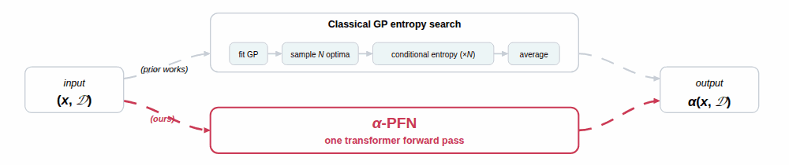

# $\alpha$-PFN: Fast Entropy Search via In-Context Learning

[](https://pypi.org/project/alphapfn/)
[](https://www.python.org/downloads/)
[](LICENSE)
[](https://openreview.net/forum?id=7Oonij8oLU)
[](https://colab.research.google.com/github/automl/AlphaPFN/blob/main/examples/quickstart.ipynb)

**$\alpha$-PFN** is a Prior-Fitted Network that amortizes information-theoretic acquisition functions. Supported acquisition functions: Predictive Entropy Search (PES), Max-value Entropy Search (MES), and Joint Entropy Search (JES). 

<p align="center">
  
</p>

> To reproduce our ICML 2026 paper experiments, see branch
> [`icml2026`](https://github.com/automl/AlphaPFN/tree/icml2026).

## Install

```bash
pip install "alphapfn[botorch]"
```

Or from source:

```bash
git clone https://github.com/automl/AlphaPFN
cd AlphaPFN
uv sync --extra botorch
```

Pretrained checkpoints (~20 MB) download automatically on the first `from_pretrained` call and cache under `~/.cache/alphapfn/`.

## Quick start

A self-contained 6D BO loop on Hartmann, using `botorch.optim.optimize_acqf`:

```python
import torch
from botorch.optim import optimize_acqf
from botorch.test_functions import Hartmann
from alphapfn import AlphaPFN

# 1. Objective on the unit cube (α-PFN maximizes — `negate=True` flips Hartmann's sign).
hartmann = Hartmann(dim=6, negate=True)

# 2. Initial design.
torch.manual_seed(0)
d, n_init, num_steps = 6, 6, 30
X = torch.rand(n_init, d, dtype=torch.double)
y = hartmann(X)
bounds = torch.stack([torch.zeros(d), torch.ones(d)]).double()

# 3. Load the pretrained acquisition; checkpoints download on first call.
acqf = AlphaPFN.from_pretrained(acquisition="JES")

# 4. BO loop.
for step in range(num_steps):
    acqf.fit(X, y)                            # fit() standardizes y internally
    X_next, _ = optimize_acqf(acqf, bounds=bounds, q=1,
                              num_restarts=10, raw_samples=128)
    y_next = hartmann(X_next.squeeze(0))
    X = torch.cat([X, X_next.detach().double()])
    y = torch.cat([y, y_next.detach().double().reshape(1)])
    print(f"step {step+1:>2}: best so far = {y.max().item():.4f}")
```

Runnable version: [`examples/bo_with_optimize_acqf.py`](examples/bo_with_optimize_acqf.py)
or open the [Colab notebook](https://colab.research.google.com/github/automl/AlphaPFN/blob/main/examples/quickstart.ipynb).

## API

```python
AlphaPFN.from_pretrained(
    acquisition: str | None = None,   # "PES" (default), "MES", or "JES"
    version: str = "v1",
    *,
    load_base_model: bool = False,
    ucb_beta: float = 2.0,
    strict: bool = True,              # pass strict=False to skip input checks
)
```

Before fitting, prepare your data so that:
- **You are maximizing.** To minimize instead, negate your objective.
  This is NOT checked, so forgetting it silently gives wrong results.
- **Each input feature lies in `[0, 1]`.** Rescale your search space accordingly.

`fit()` standardizes targets internally (`standardize_y=True` by default) — pass raw $y$. Pass `standardize_y=False` if you have already standardized. `strict=True` (default) validates the unit-cube contract on every `fit`/`forward`; pass `strict=False` to skip.

## Cite

```bibtex
@inproceedings{
  rakotoarison2026alphapfn,
  title={{$\alpha$}-PFN: Fast Entropy Search via In-Context Learning},
  author={Rakotoarison, Herilalaina and Adriaensen, Steven and Viering, Tom and Hvarfner, Carl and M{\"u}ller, Samuel and Hutter, Frank and Bakshy, Eytan},
  booktitle={Forty-third International Conference on Machine Learning},
  year={2026},
  url={https://openreview.net/forum?id=7Oonij8oLU}
}
```
